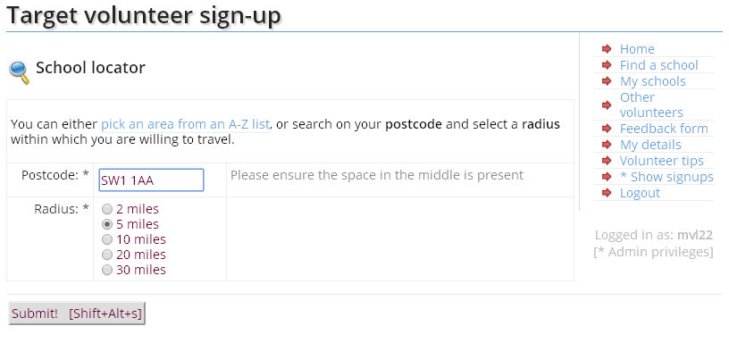

Target volunteer signup system
==============================

This is a PHP application which implements a target volunteer signup system, enabling students to sign up to visit Target schools and colleges and give feedback on their visit.

Screenshot
----------

Usage
-----

1. Clone the repository.
2. Download the library dependencies and ensure they are in your PHP include_path.
3. Add the Apache directives in httpd.conf (and restart the webserver) as per the example given in .httpd.conf.extract.txt; the example assumes mod_macro but this can be easily removed.
4. Create a copy of the index.html.example file as index.html in the URL directory where the application will run from, and fill in the parameters.
5. Access the page in a browser at a URL which is served by the webserver.

Dependencies
------------

* [application.php application support library](http://download.geog.cam.ac.uk/projects/application/)
* [database.php database wrapper library](http://download.geog.cam.ac.uk/projects/database/)
* [pureContent.php general environment library](http://download.geog.cam.ac.uk/projects/purecontent/)
* [timedate.php timedate library](http://download.geog.cam.ac.uk/projects/timedate/)
* [ultimateForm.php form library](http://download.geog.cam.ac.uk/projects/ultimateform/)

Author
------

Martin Lucas-Smith, CUSU, 2006-10, based on much earlier code (2004/5) by Veriqual (see history below).

License
-------

GPL2.

History
-------

This system was initially put together in 2004/5 by Veriqual.com (based in Pakistan) as an outsourced project.

The code was insecure, inconsistent, had errors (but mostly worked) and was typical procedural PHP.

Veriqual are incredibly still advertising the ancient and now-replaced system on their site, with our artwork created more recently (without permission): http://www.veriqual.com/portfolio/cusu.php

In March 2006, the entire system was paintakingly refactored into a proper front-controller -based application, as here, by mvl22.

The opportunity was also taken to migrate to Raven authentication (and rip out the internal user system) and also restructure the database.

Further development was undertaken in May 2008, to convert to UTF-8, remove deprecated library API calls and add further functionality.

It was heavily used in the 2007-2008, 2008-2009 and 2011-2012 academic years. In the other years, the application fell into disuse, probably simply because it wasn't being linked to from parts of the site and officers were unaware of it.

The application now needs significant modernisation in terms of a brighter UI, and areas of the code need modernisation, e.g. to use prepared statement calls and other improved restructuring.

